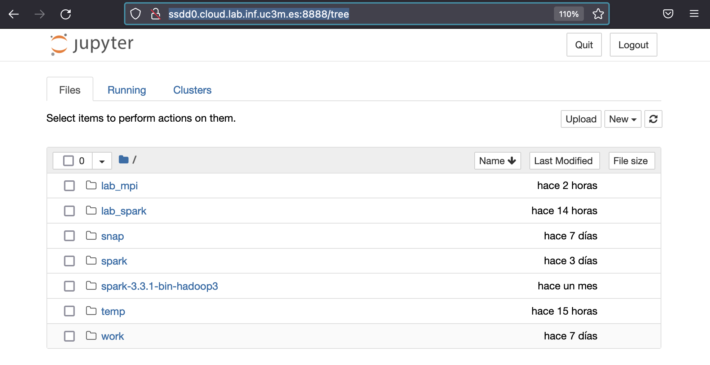
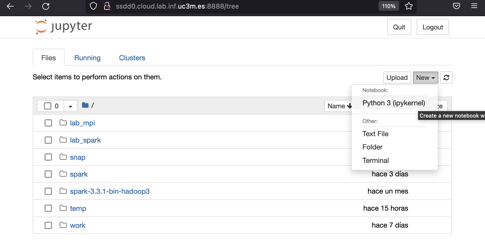
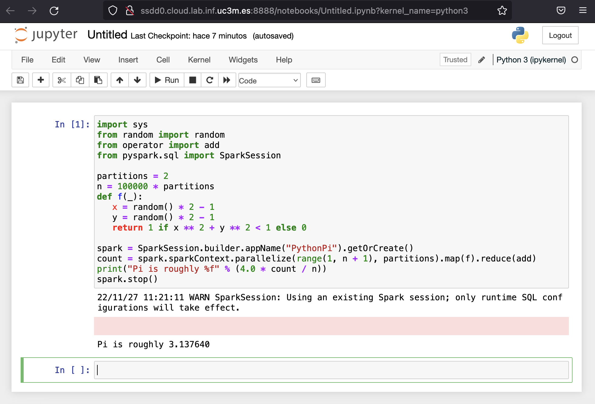
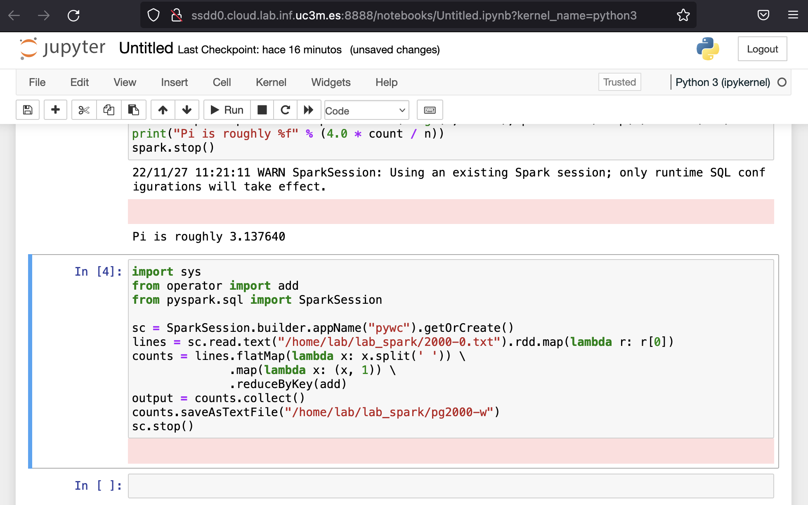
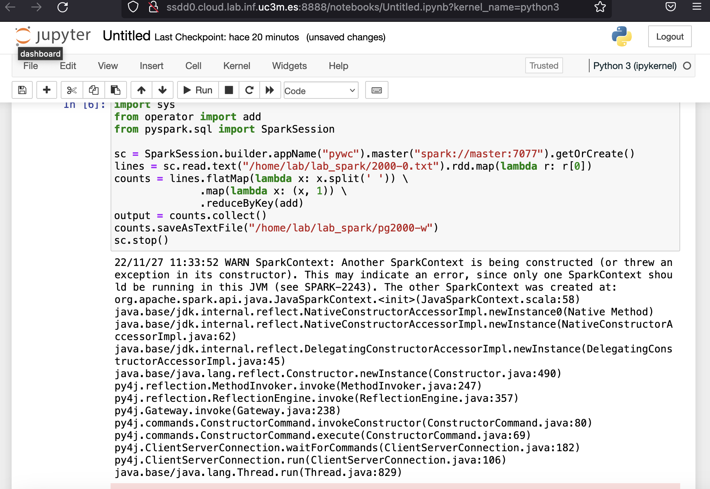

## Materiales para Sistemas Paralelos y Distribuidos

<html>
<ul>
<li> <a href="https://github.com/acaldero/uc3m_ssdd/blob/main/LICENSE">License</a> </li>
<li> Curso 2023-2024</li>
</ul>
</html>


## Alta Escalabilidad en Sistemas Distribuidos

1 Máquinas de trabajo:
  * [1.1 Pre-requisitos para trabajar en ssddX.cloud.lab.inf.uc3m.es](#11-pre-requisitos-para-trabajar-en-ssddx.cloud.lab.inf.uc3m.es)
  * [1.2 Conexión SSH con las máquinas de trabajo](#11-conexion-ssh-con-las-maquinas-de-trabajo)

2 Software necesario:
  * [2.1 Instalación de Python](#21-instalacion-de-python)
  * [2.2 Instalación de Apache Spark](#22-instalacion-de-apache-spark)

3 Ejemplos para aprender:
  * [3.1 Apache Spark en nodo autónomo y shell interactivo](#31-apache-spark-en-nodo-autonomo-y-shell-interactivo)
  * [3.2 Ejemplo: cálculo de pi en nodo autónomo y shell interactivo](#32-ejemplo-calculo-de-pi-en-nodo-autonomo-y-shell-interactivo)
  * [3.3 Ejemplo: contar ocurrencias de palabras en fichero autónomo y shell interactivo](#33-ejemplo-contar-ocurrencias-de-palabras-en-nodo-autonomo-y-shell-interactivo)
  * [3.4 Ejemplo: uso de jupyter notebook](#34-ejemplo-uso-de-jupyter-notebook)
  * [3.5 Ejemplo: uso de jupyter notebook con cluster](#34-ejemplo-uso-de-jupyter-notebook-con-cluster)

[Agradecimientos](#agradecimientos)


## Máquinas de trabajo

### 1.1 Pre-requisitos para trabajar en ssddX.cloud.lab.inf.uc3m.es

Ha de disponer de:
1. Cuenta en el Laboratorio del Departamento de Informática.
2. El software MobaXterm (o similar).
3. Estar conectado dentro de la red de la Universidad, ya sea con VPN o con conexión a través de guernika.lab.inf.uc3m.es.

Como ayuda:
1. Para solicitar la apertura de cuenta siga los pasos indicados en: https://www.lab.inf.uc3m.es/servicios/apertura-de-cuenta/
2. El Laboratorio del Departamento de Informática dispone de un manual de MobaXterm en: https://www.lab.inf.uc3m.es/wp-content/docs/Manual_ConexionSSH.pdf
3. La información de VPN para la Universidad está en: https://www.uc3m.es/sdic/servicios/vpn


### 1.2 Conexión SSH con las máquinas de trabajo

* Estando dentro de la Universidad para iniciar la sesión de trabajo ha de conectarse a ssddX.cloud.lab.inf.uc3m.es, siendo X = {0, 1, ... 8}:
```
ssh  lab@ssdd0.cloud.lab.inf.uc3m.es
lab@ssdd0.lab.inf.uc3m.es's password: <clave que no se mostrará cuando escriba>
Linux ssdd0...
...
```

* Una vez que finalice su sesión de trabajo, ha de cerrar cada conexión abierta usando el mandato exit:
```
exit
```


## Software necesario

### 2.1 Instalación de Python

Para los ejemplos usaremos PIP.

<html>
<table>

<tr>
<td></td>
<td>Uso de PIP</td>
</tr>

<tr>
<td>Instalar Python3</td>
<td>
<small><pre>
sudo apt-get install \
     python3-minimal python3-pip
sudo pip install py4j
</pre></small>
</td>
</tr>

<tr>
<td>Soporte para jupyter</td>
<td><pre>sudo apt-get install jupyter-notebook</pre></td>
</tr>

<tr>
<td>Prueba básica</td>
<td colspan="1"><pre>jupyter notebook</pre></td>
</tr>

</table>
</html>


### 2.2 Instalación de Apache Spark

Para instalar las dependencias puede ejecutar:
```
sudo apt-get install ssh rsync default-jdk
```

Para instalar Apache Spark en su cuenta personal puede ejecutar:
```
cd $HOME
wget https://dlcdn.apache.org/spark/spark-3.5.0/spark-3.5.0-bin-hadoop3.tgz
tar zxf spark-3.5.0-bin-hadoop3.tgz
ln   -s spark-3.5.0-bin-hadoop3  spark
```

La prueba básica de que funciona la instalación es:
```
./spark/bin/run-example SparkPi 5
```
Debería de ver una salida como la siguiente:
```
...
23/11/06 19:39:33 WARN NativeCodeLoader: Unable to load native-hadoop library for your platform... using builtin-java classes where applicable
23/11/06 19:39:34 INFO SparkContext: Running Spark version 3.3.0
...
23/11/06 19:39:37 INFO Executor: Finished task 4.0 in stage 0.0 (TID 4). 965 bytes result sent to driver
23/11/06 19:39:37 INFO TaskSetManager: Finished task 4.0 in stage 0.0 (TID 4) in 29 ms on master (executor driver) (5/5)
23/11/06 19:39:37 INFO TaskSchedulerImpl: Removed TaskSet 0.0, whose tasks have all completed, from pool
23/11/06 19:39:37 INFO DAGScheduler: ResultStage 0 (reduce at SparkPi.scala:38) finished in 0.721 s
23/11/06 19:39:37 INFO DAGScheduler: Job 0 is finished. Cancelling potential speculative or zombie tasks for this job
23/11/06 19:39:37 INFO TaskSchedulerImpl: Killing all running tasks in stage 0: Stage finished
23/11/06 19:39:37 INFO DAGScheduler: Job 0 finished: reduce at SparkPi.scala:38, took 0.811302 s
Pi is roughly 3.143214286428573
23/11/06 19:39:37 INFO SparkUI: Stopped Spark web UI at http://master:4040
23/11/06 19:39:37 INFO MapOutputTrackerMasterEndpoint: MapOutputTrackerMasterEndpoint stopped!
23/11/06 19:39:37 INFO MemoryStore: MemoryStore cleared
23/11/06 19:39:37 INFO BlockManager: BlockManager stopped
23/11/06 19:39:37 INFO BlockManagerMaster: BlockManagerMaster stopped
23/11/06 19:39:37 INFO OutputCommitCoordinator$OutputCommitCoordinatorEndpoint: OutputCommitCoordinator stopped!
23/11/06 19:39:37 INFO SparkContext: Successfully stopped SparkContext
23/11/06 19:39:37 INFO ShutdownHookManager: Shutdown hook called
23/11/06 19:39:37 INFO ShutdownHookManager: Deleting directory /tmp/spark-884729c2-f718-4e64-b580-2dabf8f90b7d
23/11/06 19:39:37 INFO ShutdownHookManager: Deleting directory /tmp/spark-605c2a10-8958-4ca2-a13b-e4943312c7d3
```


## Ejemplos para aprender

### 3.1 Apache Spark en nodo autónomo y shell interactivo

Para trabajar con un shell interactivo en un nodo autónomo hay que ejecutar:
```
./spark/bin/pyspark  --master local[2]
```

Donde el parámetro de "--master" puede ser:
* local	    -> 1 hilo
* local[N]  -> N hilos
* local[\*] -> tantos hilos como cores haya en el sistema (nproc --all)


Tras ejecutar pyspark como se ha indicado anteriormente, la salida debería ser parecida a:
```
Python 3.11.5 (main, Sep 11 2023, 13:54:46) [GCC 11.2.0] on linux
Type "help", "copyright", "credits" or "license" for more information.
Setting default log level to "WARN".
To adjust logging level use sc.setLogLevel(newLevel). For SparkR, use setLogLevel(newLevel).
...
Welcome to
      ____              __
     / __/__  ___ _____/ /__
    _\ \/ _ \/ _ `/ __/  '_/
   /__ / .__/\_,_/_/ /_/\_\   version 3.3.0
      /_/

Using Python version 3.11.5 (main, Sep 11 2023 13:54:46)
Spark context Web UI available at http://master:4040
Spark context available as 'sc' (master = local[2], app id = local-1699296762876).
SparkSession available as 'spark'.
>>>
```

Cuando tengamos que terminar la sesión de trabajo de Apache Spark deberemos ejecutar:
```
quit()
```
También final de fichero (con las teclas control y D) debería de permitir finalizar la sesión con Apache Spark.


### 3.2 Ejemplo: cálculo de pi en nodo autónomo y shell interactivo

Para trabajar con un shell interactivo en un nodo autónomo hay que ejecutar:
```
./spark/bin/pyspark  --master local[*]
```

Spark imprime ">>>" para indicarnos que está a la espera de código Python para ejecutar.
Vamos a copiar el siguiente código en la terminal:
``` python
import sys
from random import random
from operator import add
from pyspark.sql import SparkSession

partitions = 2
n = 100000 * partitions
def f(_):
   x = random() * 2 - 1
   y = random() * 2 - 1
   return 1 if x ** 2 + y ** 2 < 1 else 0

spark = SparkSession.builder.appName("PythonPi").getOrCreate()
count = spark.sparkContext.parallelize(range(1, n + 1), partitions).map(f).reduce(add)
print("Pi is roughly %f" % (4.0 * count / n))
spark.stop()
```

Tras introducir el código y dar enter se ejecutará, y la salida debería ser parecida a:
```
>>> import sys
>>> from random import random
>>> from operator import add
>>> from pyspark.sql import SparkSession
>>> 
>>> partitions = 2
>>> n = 100000 * partitions
>>> def f(_):
...    x = random() * 2 - 1
...    y = random() * 2 - 1
...    return 1 if x ** 2 + y ** 2 < 1 else 0
... 
>>> spark = SparkSession.builder.appName("PythonPi").getOrCreate()

23/11/06 19:54:59 WARN SparkSession: Using an existing Spark session; only runtime SQL configurations will take effect.
>>> count = spark.sparkContext.parallelize(range(1, n + 1), partitions).map(f).reduce(add)
>>> print("Pi is roughly %f" % (4.0 * count / n))
Pi is roughly 3.138760
>>> spark.stop()
>>>
```

Para terminar la sesión ejecutaremos:
```
quit()
```


### 3.3 Ejemplo: contar ocurrencias de palabras en fichero en nodo autónomo y shell interactivo

Usaremos el quijote en texto plano para trabajar ([pg2000.txt](https://www.gutenberg.org/files/2000/2000-0.txt)) para lo que usaremos:
```
curl https://www.gutenberg.org/files/2000/2000-0.txt  -o $HOME/lab_spark/2000-0.txt
```

Deberemos borrar cualquier resultado anterior de trabajo:
```
rm -fr   /home/lab/lab_spark/pg2000-w
```

Para trabajar con un shell interactivo en un nodo autónomo hay que ejecutar:
```
./spark/bin/pyspark  --master local[*]
```

Spark imprime ">>>" para indicarnos que está a la espera de código Python para ejecutar.
Vamos a copiar el siguiente código en la terminal:
``` python
import sys
from operator import add
from pyspark.sql import SparkSession

sc = SparkSession.builder.appName("pywc").getOrCreate()
lines = sc.read.text("/home/lab/lab_spark/2000-0.txt").rdd.map(lambda r: r[0])
counts = lines.flatMap(lambda x: x.split(' ')) \
              .map(lambda x: (x, 1)) \
              .reduceByKey(add)
output = counts.collect()
counts.saveAsTextFile("/home/lab/lab_spark/pg2000-w")
sc.stop()
```

Tras introducir el código y dar enter se ejecutará, y la salida debería ser parecida a:
```
>>> 
>>> import sys
>>> from operator import add
>>> from pyspark.sql import SparkSession
>>> 
>>> sc = SparkSession.builder.appName("pywc").getOrCreate()

23/11/06 19:59:38 WARN SparkSession: Using an existing Spark session; only runtime SQL configurations will take effect.
>>> lines = sc.read.text("/home/lab/lab_spark/2000-0.txt").rdd.map(lambda r: r[0])
>>> counts = lines.flatMap(lambda x: x.split(' ')) \
...               .map(lambda x: (x, 1)) \
...               .reduceByKey(add)
>>> output = counts.collect()
>>> counts.saveAsTextFile("/home/lab/lab_spark/pg2000-w")
>>> sc.stop()
>>>
```

Para terminar la sesión ejecutaremos:
```
quit()
```

Para ver el resultado ejecutaremos:
```
cat /home/lab/lab_spark/pg2000-w/part-00000
```


### 3.4 Ejemplo: uso de jupyter notebook

Debemos configurar pyspark para que use jupyter y notebook:
```
export PATH=$HOME/spark/bin:$PATH
export PYSPARK_DRIVER_PYTHON=jupyter
export PYSPARK_DRIVER_PYTHON_OPTS='notebook --ip=0.0.0.0 --no-browser'
```

Si ejecutamos pyspark:
```
pyspark
```

En la salida nos indica una URL en la que conectarnos:
```
[I 20:00:53.903 NotebookApp] Serving notebooks from local directory: /home/lab
[I 20:00:53.903 NotebookApp] Jupyter Notebook 6.5.2 is running at:
[I 20:00:53.903 NotebookApp] http://master:8888/?token=bcefad0f329df8416ed6c4b40eb9d558bb9e1c4ed4a15ed8
[I 20:00:53.903 NotebookApp]  or http://127.0.0.1:8888/?token=bcefad0f329df8416ed6c4b40eb9d558bb9e1c4ed4a15ed8
[I 20:00:53.903 NotebookApp] Use Control-C to stop this server and shut down all kernels (twice to skip confirmation).
[C 20:00:53.907 NotebookApp]

    To access the notebook, open this file in a browser:
        file:///home/lab/.local/share/jupyter/runtime/nbserver-97145-open.html
    Or copy and paste one of these URLs:
        http://master:8888/?token=bcefad0f329df8416ed6c4b40eb9d558bb9e1c4ed4a15ed8
     or http://127.0.0.1:8888/?token=bcefad0f329df8416ed6c4b40eb9d558bb9e1c4ed4a15ed8
```

Por lo que podemos usar con esta salida la URL:
```
http://ssdd0.cloud.lab.inf.uc3m.es:8888/?token=bcefad0f329df8416ed6c4b40eb9d558bb9e1c4ed4a15ed8
```
Para conectarnos (estando en la misma red donde master es visible).

Una vez conectados+as estaremos en la página inicial: 
En la página inicial procederemos a crear un nuevo notebook: 
En el nuevo libro tendremos una nueva celda: 
En la celda podemos copiar el ejemplo de pi: 
En una nueva celda podemos copiar el número de palabras en local: 
En una nueva celda podemos copiar el número de palabras en remoto: 


### 3.5 Ejemplo: uso de jupyter notebook con cluster

Se configura los workers de Spark:
```
echo "nodo1" >> spark/conf/workers
echo "nodo2" >> spark/conf/workers
```

Todos los nodos han de poder comunicarse con SSH sin precisar clave, se recomienda este [tutorial de IBM](https://www.ibm.com/support/pages/configuring-ssh-login-without-password):
```
ssh-keygen -t rsa -P ""
ssh-copy-id -i .ssh/id_rsa.pub lab@nodo1
ssh-copy-id -i .ssh/id_rsa.pub lab@nodo2
```

Si no hay una cuenta compartida en todos los nodos entonces hay que asegurarse que se tiene la misma copia de Spark en todos los nodos:
```
scp –r spark lab@nodo1:~/
scp –r spark lab@nodo2:~/
```

En el nodo master se arranca Spark:
```
./spark/sbin/start-all.sh
```

Para trabajar en una sesión de trabajo, podemos usar pyspark y el siguiente fragmento de código:
```
val spark = SparkSession.builder()
            .appName("EjemploSpark")
            .master("spark://master:7077")
            .getOrCreate()
```
El [tutorial](https://towardsdatascience.com/how-to-connect-jupyter-notebook-to-remote-spark-clusters-and-run-spark-jobs-every-day-2c5a0c1b61df) muestra un entorno parecido.

El programa cambia solo añadiendo ".master("spark://master:7077")" en nuestro ejemplo (recuerde tener borrado ~/lab_spark/pg2000-w antes):
```
import sys
from operator import add
from pyspark.sql import SparkSession

sc = SparkSession.builder.appName("pywc").master("spark://master:7077").getOrCreate()
lines = sc.read.text("/home/lab/lab_spark/2000-0.txt").rdd.map(lambda r: r[0])
counts = lines.flatMap(lambda x: x.split(' ')) \
              .map(lambda x: (x, 1)) \
              .reduceByKey(add)
output = counts.collect()
counts.saveAsTextFile("/home/lab/lab_spark/pg2000-w")
sc.stop()
```

En el nodo master cuando se termine la sesión de trabajo se para Spark usando:
```
./spark/sbin/stop-all.sh
```


## Bibliografía de ejemplos de Spark

* [Ejemplos iniciales de uso de Spark](https://spark.apache.org/examples.html)
* [Ejemplos en python](https://github.com/apache/spark/tree/master/examples/src/main/python)


## Agradecimientos

Por último pero no por ello menos importante, agradecer al personal del Laboratorio del Departamento de Informática toda la ayuda prestada para que este laboratorio sea posible.

