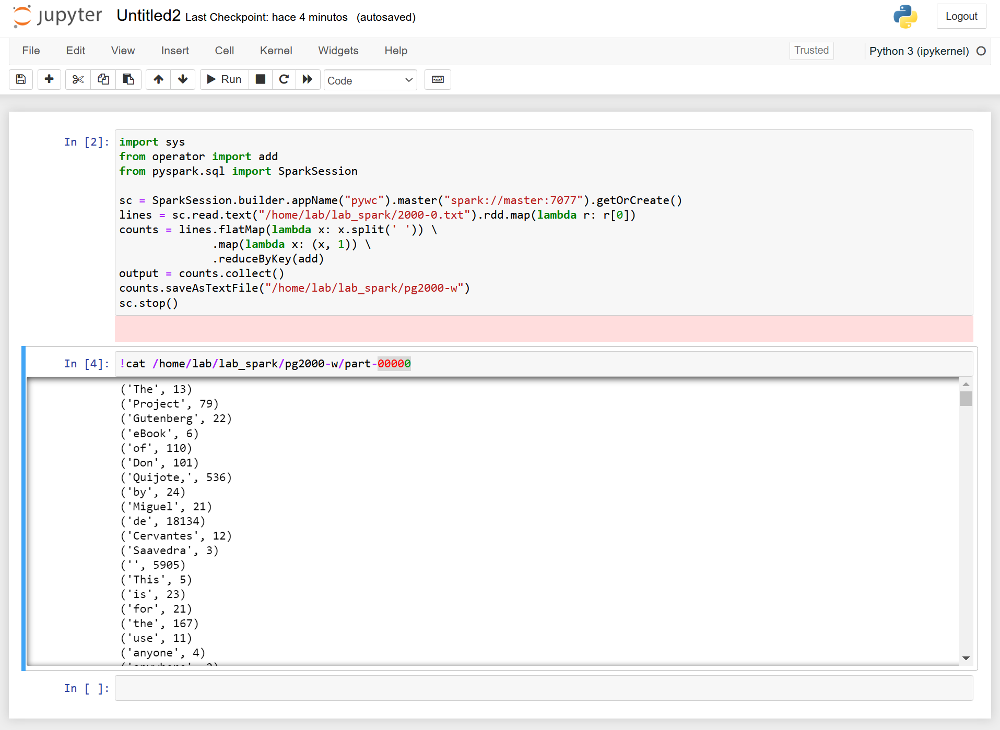

## Materiales para Sistemas Paralelos y Distribuidos

<html>
<ul>
<li> <a href="https://github.com/acaldero/uc3m_ssdd/blob/main/LICENSE">License</a> </li>
<li> Curso 2024-2025</li>
</ul>
</html>


## Alta Escalabilidad en Sistemas Distribuidos

1 Máquinas de trabajo:
  * [1.1 Pre-requisitos para trabajar en ssddX.cloud.lab.inf.uc3m.es](#11-pre-requisitos-para-trabajar-en-ssddxcloudlabinfuc3mes)
  * [1.2 Conexión SSH con las máquinas de trabajo](#12-conexi%C3%B3n-ssh-con-las-m%C3%A1quinas-de-trabajo)

2 Software necesario:
  * [2.1 Instalación de Python](#21-instalaci%C3%B3n-de-python-y-pip) 
  * [2.2 Instalación de Apache Spark](#22-instalaci%C3%B3n-de-apache-spark)

3 Ejemplos para aprender:
  * [3.1 Apache Spark en nodo autónomo y shell interactivo](#31-apache-spark-en-nodo-aut%C3%B3nomo-y-shell-interactivo)
  * [3.2 Ejemplo: cálculo de pi en nodo autónomo y shell interactivo](#32-ejemplo-c%C3%A1lculo-de-pi-en-nodo-aut%C3%B3nomo-y-shell-interactivo)
  * [3.3 Ejemplo: contar ocurrencias de palabras en fichero autónomo y shell interactivo](#33-ejemplo-contar-ocurrencias-de-palabras-en-fichero-en-nodo-aut%C3%B3nomo-y-shell-interactivo)
  * [3.4 Ejemplo: uso de jupyter notebook](#34-ejemplo-uso-de-jupyter-notebook)
  * [3.5 Ejemplo: uso de jupyter notebook con cluster](#35-ejemplo-uso-de-jupyter-notebook-con-cluster)

[Agradecimientos](#agradecimientos)


## Máquinas de trabajo

### 1.1 Pre-requisitos para trabajar en ssddX.cloud.lab.inf.uc3m.es

* Ha de disponer de:
  1. Cuenta en el Laboratorio del Departamento de Informática.
  2. El software MobaXterm (o similar).
  3. Estar conectado dentro de la red de la Universidad, ya sea con VPN o con conexión a través de guernika.lab.inf.uc3m.es.

* Como ayuda:
  1. Para solicitar la apertura de cuenta siga los pasos indicados en:  
     https://www.lab.inf.uc3m.es/servicios/apertura-de-cuenta/
  3. El Laboratorio del Departamento de Informática dispone de un manual de MobaXterm en:  
     https://www.lab.inf.uc3m.es/wp-content/docs/Manual_ConexionSSH.pdf
  5. La información de VPN para la Universidad está en:  
     https://www.uc3m.es/sdic/servicios/vpn


### 1.2 Conexión SSH con las máquinas de trabajo

* Estando dentro de la Universidad para iniciar la sesión de trabajo ha de conectarse a ssddX.cloud.lab.inf.uc3m.es, siendo X = {0, 1, ... 9}:
  ```
  ssh  lab@ssdd0.cloud.lab.inf.uc3m.es
  lab@ssdd0.lab.inf.uc3m.es's password: <clave que no se mostrará cuando escriba>
  Linux ssdd0...
  ...
  ```

* Una vez que finalice su sesión de trabajo, ha de cerrar cada conexión abierta usando el mandato **exit**:
  ```
  exit
  ```


## Software necesario

### 2.1 Instalación de Python (y PIP)  

*  
  <html>
  <table>
  <tr>
  <td>Paso</td>
  <td>Mandato</td>
  </tr>
  <tr>
  <td>Instalar Python3</td>
  <td>
  <small><pre>
  sudo apt-get install python3-minimal python3-pip
  sudo pip install py4j
  </pre></small>
  </td>
  </tr>
  <tr>
  <td>Instalar soporte para jupyter</td>
  <td><pre>sudo apt-get install jupyter-notebook</pre></td>
  </tr>
  <tr>
  <td>Prueba básica</td>
  <td colspan="1"><pre>jupyter notebook</pre></td>
  </tr>
  </table>
  </html>


### 2.2 Instalación de Apache Spark

* Para instalar las dependencias puede ejecutar:
  ```
  sudo apt-get install ssh rsync default-jdk
  ```

* Para instalar Apache Spark en su cuenta personal puede ejecutar:
  ```
  cd $HOME
  wget https://dlcdn.apache.org/spark/spark-3.5.3/spark-3.5.3-bin-hadoop3.tgz
  tar zxf spark-3.5.3-bin-hadoop3.tgz
  ln   -s spark-3.5.3-bin-hadoop3  spark
  ```

* Después de instalar, hay que configurar dos variables de entorno para usar Apache Spark:
  ```
  export SPARK_HOME=$HOME/spark
  export PATH=$PATH:$SPARK_HOME/bin:$SPARK_HOME/sbin
  ```

* La prueba básica de que funciona la instalación es:
  ```
  ./spark/bin/run-example SparkPi 5
  ```
  
* Debería de ver una salida como la siguiente:
  ```
  24/10/20 12:18:30 WARN NativeCodeLoader: Unable to load native-hadoop library for your platform...
  ...
  24/10/20 12:18:32 INFO SparkContext: Starting job: reduce at SparkPi.scala:38
  24/10/20 12:18:32 INFO DAGScheduler: Got job 0 (reduce at SparkPi.scala:38) with 5 output partitions
  ...
  24/10/20 12:18:32 INFO DAGScheduler: Job 0 is finished. Cancelling potential speculative or zombie tasks for this job
  24/10/20 12:18:32 INFO TaskSchedulerImpl: Killing all running tasks in stage 0: Stage finished
  24/10/20 12:18:32 INFO DAGScheduler: Job 0 finished: reduce at SparkPi.scala:38, took 0.458716 s
  Pi is roughly 3.143406286812574
  24/10/20 12:18:32 INFO SparkContext: SparkContext is stopping with exitCode 0.
  24/10/20 12:18:32 INFO SparkUI: Stopped Spark web UI at http://master:4040
  24/10/20 12:18:33 INFO MapOutputTrackerMasterEndpoint: MapOutputTrackerMasterEndpoint stopped!
  24/10/20 12:18:33 INFO MemoryStore: MemoryStore cleared
  24/10/20 12:18:33 INFO BlockManager: BlockManager stopped
  24/10/20 12:18:33 INFO BlockManagerMaster: BlockManagerMaster stopped
  24/10/20 12:18:33 INFO OutputCommitCoordinator$OutputCommitCoordinatorEndpoint: OutputCommitCoordinator stopped!
  24/10/20 12:18:33 INFO SparkContext: Successfully stopped SparkContext
  24/10/20 12:18:33 INFO ShutdownHookManager: Shutdown hook called
  24/10/20 12:18:33 INFO ShutdownHookManager: Deleting directory /tmp/spark-aa764165-433d-4601-9365-ee5c1b6c5b82
  24/10/20 12:18:33 INFO ShutdownHookManager: Deleting directory /tmp/spark-0bc7c845-d7ac-43c7-874a-1e8bdb86a92d
  ```


## Ejemplos para aprender

### 3.1 Apache Spark en nodo autónomo y shell interactivo

* Para trabajar con un shell interactivo en un nodo autónomo hay que ejecutar:
  ```
  ./spark/bin/pyspark  --master local[2]
  ```
  Donde el parámetro de "--master" puede ser:
  * local	    -> 1 hilo
  * local[N]  -> N hilos
  * local[\*] -> tantos hilos como cores haya en el sistema (nproc --all)


* Tras ejecutar pyspark como se ha indicado anteriormente, la salida debería ser parecida a:
  ```
  Python 3.10.12 (main, Sep 11 2024, 15:47:36) [GCC 11.4.0] on linux
  Type "help", "copyright", "credits" or "license" for more information.
  Setting default log level to "WARN".
  To adjust logging level use sc.setLogLevel(newLevel). For SparkR, use setLogLevel(newLevel).
  ...
  Welcome to
      ____              __
     / __/__  ___ _____/ /__
    _\ \/ _ \/ _ `/ __/  '_/
   /__ / .__/\_,_/_/ /_/\_\   version 3.5.0
      /_/

  Using Python version 3.10.12 (main, Sep 11 2024 15:47:36)
  Spark context Web UI available at http://master:4040
  Spark context available as 'sc' (master = local[2], app id = local-1729426762360).
  SparkSession available as 'spark'.
  >>>
  ```

* Cuando tengamos que terminar la sesión de trabajo de Apache Spark deberemos ejecutar:
  ```
  quit()
  ```
  También el caracter "final de fichero" (con las teclas control y D) debería de permitir finalizar la sesión con Apache Spark.


### 3.2 Ejemplo: cálculo de pi en nodo autónomo y shell interactivo

* Para trabajar con un shell interactivo en un nodo autónomo hay que ejecutar:
  ```
  ./spark/bin/pyspark  --master local[*]
  ```

* Spark imprime ">>>" para indicarnos que está a la espera de código Python para ejecutar.
  Vamos a copiar el siguiente código en la terminal:
  ``` python
  import sys
  from random import random
  from operator import add
  from pyspark.sql import SparkSession

  partitions = 2
  n = 100000 * partitions
  def f(_):
     x = random() * 2 - 1
     y = random() * 2 - 1
     return 1 if x ** 2 + y ** 2 < 1 else 0

  spark = SparkSession.builder.appName("PythonPi").getOrCreate()
  count = spark.sparkContext.parallelize(range(1, n + 1), partitions).map(f).reduce(add)
  print("Pi is roughly %f" % (4.0 * count / n))
  spark.stop()
  ```

* Tras introducir el código y dar enter se ejecutará, y la salida debería ser parecida a:
  ```
  >>> import sys
  >>> from random import random
  >>> from operator import add
  >>> from pyspark.sql import SparkSession
  >>>
  >>> partitions = 2
  >>> n = 100000 * partitions
  >>> def f(_):
  ...    x = random() * 2 - 1
  ...    y = random() * 2 - 1
  ...    return 1 if x ** 2 + y ** 2 < 1 else 0
  ...
  >>> spark = SparkSession.builder.appName("PythonPi").getOrCreate()

  24/10/20 12:19:33 WARN SparkSession: Using an existing Spark session; only runtime SQL configurations will take effect.
  >>> count = spark.sparkContext.parallelize(range(1, n + 1), partitions).map(f).reduce(add)
  >>> print("Pi is roughly %f" % (4.0 * count / n))
  Pi is roughly 3.132920
  >>> spark.stop()
  >>>
  ```

* Para terminar la sesión ejecutaremos:
  ```
  quit()
  ```


### 3.3 Ejemplo: contar ocurrencias de palabras en fichero en nodo autónomo y shell interactivo

* Usaremos el quijote en texto plano para trabajar ([pg2000.txt](https://www.gutenberg.org/files/2000/2000-0.txt)) para lo que usaremos:
  ```
  curl https://www.gutenberg.org/files/2000/2000-0.txt  -o $HOME/lab_spark/2000-0.txt
  ```

* Deberemos borrar cualquier resultado anterior de trabajo:
  ```
  rm -fr   /home/lab/lab_spark/pg2000-w
  ```

* Para trabajar con un shell interactivo en un nodo autónomo hay que ejecutar:
  ```
  ./spark/bin/pyspark  --master local[*]
  ```

* Spark imprime ">>>" para indicarnos que está a la espera de código Python para ejecutar.
  Vamos a copiar el siguiente código en la terminal:
  ``` python
  import sys
  from operator import add
  from pyspark.sql import SparkSession

  sc = SparkSession.builder.appName("pywc").getOrCreate()
  lines = sc.read.text("/home/lab/lab_spark/2000-0.txt").rdd.map(lambda r: r[0])
  counts = lines.flatMap(lambda x: x.split(' ')) \
                .map(lambda x: (x, 1)) \
                .reduceByKey(add)
  output = counts.collect()
  counts.saveAsTextFile("/home/lab/lab_spark/pg2000-w")
  sc.stop()
  ```

* Tras introducir el código y dar enter se ejecutará, y la salida debería ser parecida a:
  ```
  >>> 
  >>> import sys
  >>> from operator import add
  >>> from pyspark.sql import SparkSession
  >>>
  >>> sc = SparkSession.builder.appName("pywc").getOrCreate()

  24/10/20 12:20:27 WARN SparkSession: Using an existing Spark session; only runtime SQL configurations will take effect.
  >>> lines = sc.read.text("/home/lab/lab_spark/2000-0.txt").rdd.map(lambda r: r[0])
  >>> counts = lines.flatMap(lambda x: x.split(' ')) \
  ...               .map(lambda x: (x, 1)) \
  ...               .reduceByKey(add)
  >>> output = counts.collect()
  >>> counts.saveAsTextFile("/home/lab/lab_spark/pg2000-w")
  >>> sc.stop()
  >>>
  ```

* Para terminar la sesión ejecutaremos:
  ```
  quit()
  ```

* Para ver el resultado ejecutaremos:
  ```
  cat /home/lab/lab_spark/pg2000-w/part-00000
  ```


### 3.4 Ejemplo: uso de jupyter notebook

* Debemos configurar pyspark para que use jupyter y notebook:
  ```
  export PATH=$HOME/spark/bin:$PATH
  export PYSPARK_DRIVER_PYTHON=jupyter
  export PYSPARK_DRIVER_PYTHON_OPTS='notebook --ip=0.0.0.0 --no-browser'
  ```

* A continuación debemos ejecutamos *pyspark*:
  ```
  pyspark
  ```

* En la salida de la ejecución de *pyspark* debemos buscar la URL en la que conectarnos:
  ```
  [I 20:00:53.903 NotebookApp] Serving notebooks from local directory: /home/lab
  [I 20:00:53.903 NotebookApp] Jupyter Notebook 6.5.2 is running at:
  [I 20:00:53.903 NotebookApp] http://master:8888/?token=bcefad0f329df8416ed6c4b40eb9d558bb9e1c4ed4a15ed8
  [I 20:00:53.903 NotebookApp]  or http://127.0.0.1:8888/?token=bcefad0f329df8416ed6c4b40eb9d558bb9e1c4ed4a15ed8
  [I 20:00:53.903 NotebookApp] Use Control-C to stop this server and shut down all kernels (twice to skip confirmation).
  [C 20:00:53.907 NotebookApp]

    To access the notebook, open this file in a browser:
        file:///home/lab/.local/share/jupyter/runtime/nbserver-97145-open.html
    Or copy and paste one of these URLs:
        http://master:8888/?token=bcefad0f329df8416ed6c4b40eb9d558bb9e1c4ed4a15ed8
     or http://127.0.0.1:8888/?token=bcefad0f329df8416ed6c4b40eb9d558bb9e1c4ed4a15ed8
  ```

* Para conectarnos debemos usar el nombre de la máquina *master* visible en nuestra red, en nuestro caso hay que cambiar *master* por *ssddX.cloud.lab.inf.uc3m.es*: 
  ```
  http://ssdd0.cloud.lab.inf.uc3m.es:8888/?token=bcefad0f329df8416ed6c4b40eb9d558bb9e1c4ed4a15ed8
  ```

* Una vez conectados+as estaremos en la página inicial:  
  

* En la página inicial procederemos a crear un nuevo notebook:  
  
  
* En el nuevo libro tendremos una nueva celda:  
  
  
* En la celda podemos copiar el ejemplo de PI (y ejecutarlo):  
  
  
* En una nueva celda podemos copiar el ejemplo de contar el número de palabras en local (y ejecutarlo):  
  
  
* En una nueva celda podemos copiar el ejemplo de contar el número de palabras en remoto (y ejecutarlo):  
  


### 3.5 Ejemplo: uso de jupyter notebook con cluster

* Se configura los workers de Spark:
  ```
  echo "nodo1" >> spark/conf/workers
  echo "nodo2" >> spark/conf/workers
  ```

* Todos los nodos han de poder comunicarse con SSH sin precisar clave.  
  En caso de ser necesario, hay que ejecutar:
  ```
  ssh-keygen -t rsa -P ""
  ssh-copy-id -i .ssh/id_rsa.pub lab@nodo1
  ssh-copy-id -i .ssh/id_rsa.pub lab@nodo2
  ```
  Se recomienda este [tutorial de IBM](https://www.ibm.com/support/pages/configuring-ssh-login-without-password) para más información al respecto de este paso.

* Si no hay una cuenta compartida en todos los nodos entonces hay que asegurarse que se tiene la misma copia de Spark en todos los nodos mediante:
  ```
  scp –r spark lab@nodo1:~/
  scp –r spark lab@nodo2:~/
  ```

* En el nodo master hay que arrancar *Spark*:
  ```
  ./spark/sbin/start-all.sh
  ```

* Recuerde antes tener borrado el directorio $HOME/lab_spark/pg2000-w que pueda tener alguna ejecución previa:
  ```
  rm -fr $HOME/lab_spark/pg2000-w
  ```

* El programa cambia solo añadiendo ".master("spark://master:7077")" en nuestro ejemplo:
  ```
  import sys
  from operator import add
  from pyspark.sql import SparkSession

  sc = SparkSession.builder.appName("pywc").master("spark://master:7077").getOrCreate()
  lines = sc.read.text("/home/lab/lab_spark/2000-0.txt").rdd.map(lambda r: r[0])
  counts = lines.flatMap(lambda x: x.split(' ')) \
                .map(lambda x: (x, 1)) \
                .reduceByKey(add)
  output = counts.collect()
  counts.saveAsTextFile("/home/lab/lab_spark/pg2000-w")
  sc.stop()
  ```
  El [tutorial](https://towardsdatascience.com/how-to-connect-jupyter-notebook-to-remote-spark-clusters-and-run-spark-jobs-every-day-2c5a0c1b61df) muestra un entorno parecido.

* Para terminar la sesión ejecutaremos:
  ```
  quit()
  ```

* Para ver el resultado ejecutaremos:
  ```
  cat /home/lab/lab_spark/pg2000-w/part-00000
  ```

* En el nodo master cuando se termine la sesión de trabajo se para *Spark* usando:
  ```
  ./spark/sbin/stop-all.sh
  ```


## Bibliografía de ejemplos de Spark

* [Ejemplos iniciales de uso de Spark](https://spark.apache.org/examples.html)
* [Ejemplos en python](https://github.com/apache/spark/tree/master/examples/src/main/python)


## Agradecimientos

Por último pero no por ello menos importante, agradecer al personal del Laboratorio del Departamento de Informática toda la ayuda prestada para que este laboratorio sea posible.

